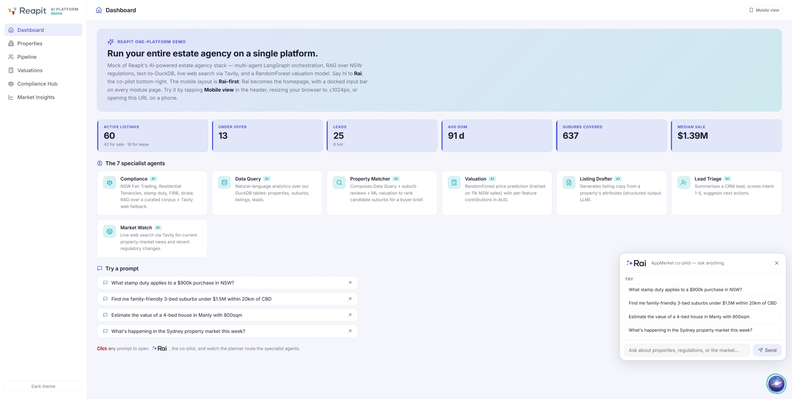
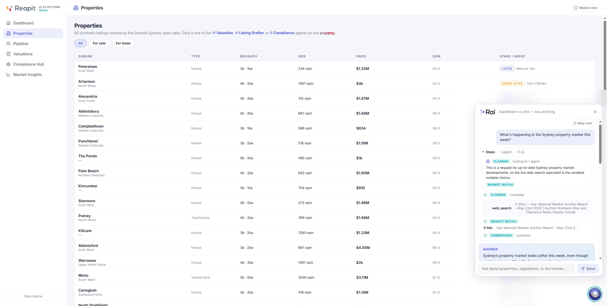
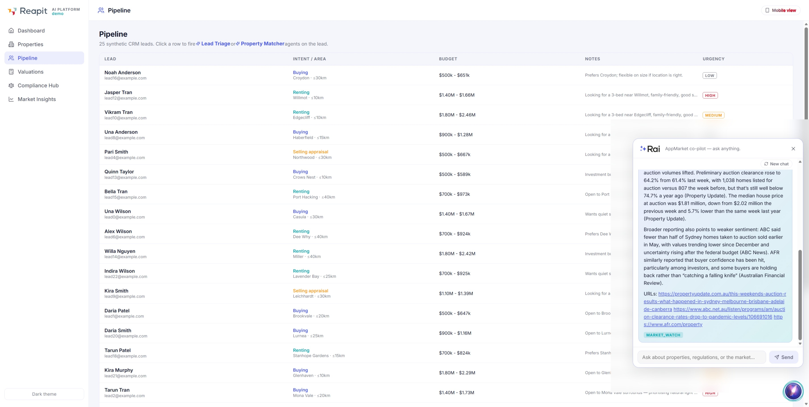
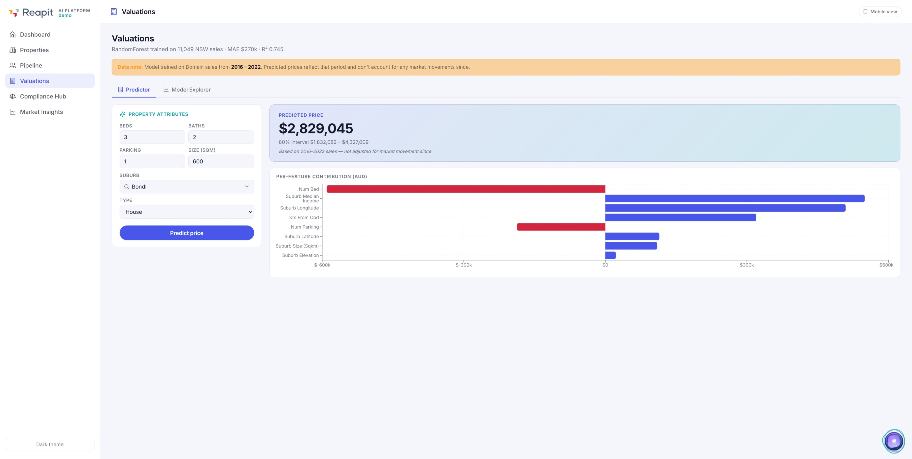
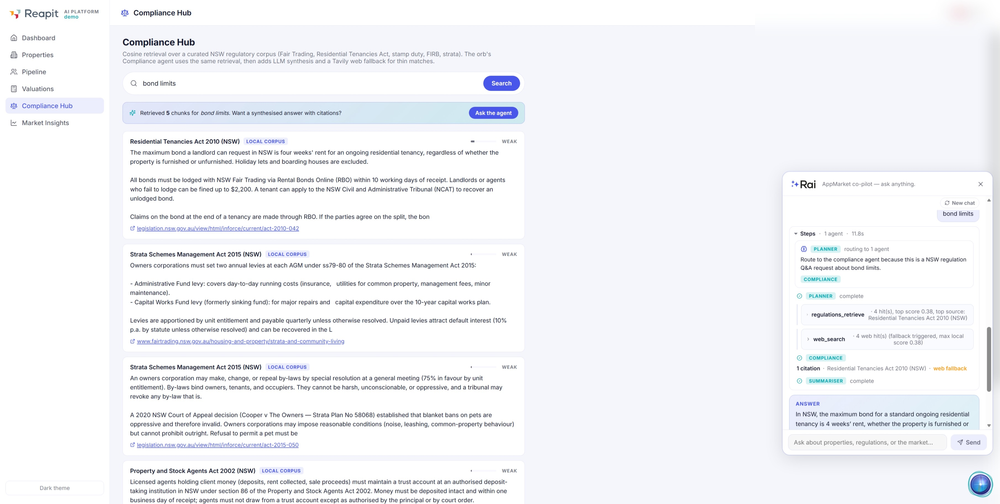
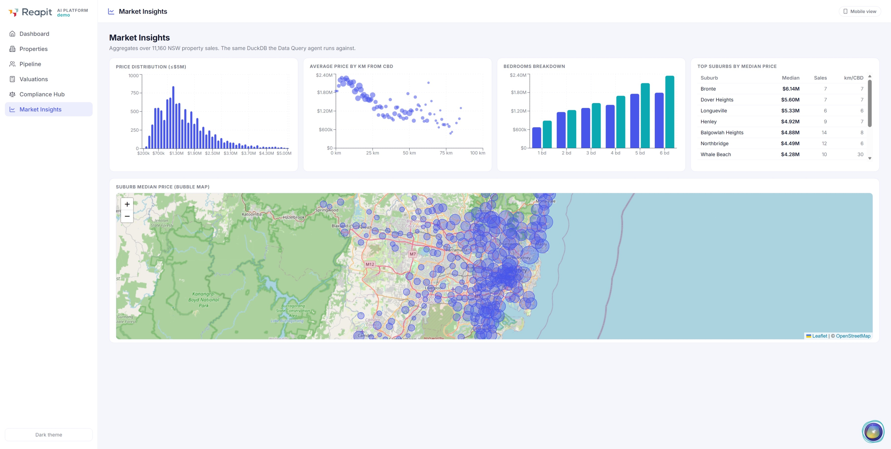
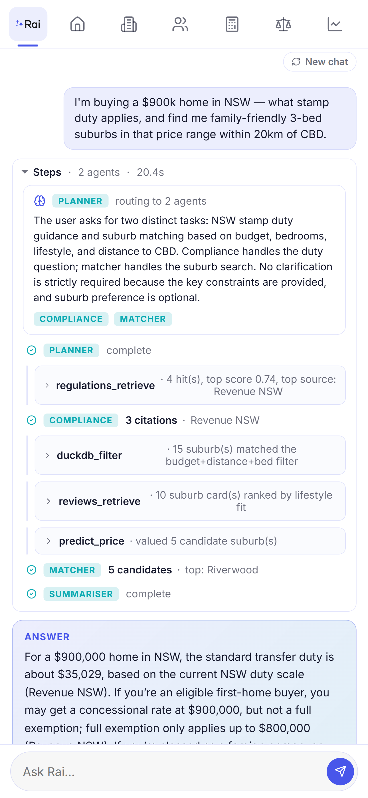
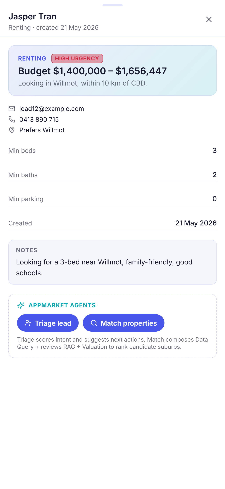

# ai-powered-app

A portfolio mock of Reapit's "One Platform" — sales, lettings, CRM, valuations,
compliance and analytics in one place, with **Rai**, a multi-agent AppMarket
co-pilot, woven through every page. Built around Sydney house-price Kaggle data
to showcase the AI-engineering stack a Reapit-grade engineer would actually
ship: LangGraph multi-agent orchestration, RAG, text-to-DuckDB, live web
search, a RandomForest valuation model, structured-output contracts, and a
three-tier eval suite with a CI gate.

> Status: **22 commits across Phase 1**, feature-complete on desktop + mobile,
> end-to-end demo working with Azure OpenAI + Tavily wired in. Phase 2 (AWS
> migration) deferred.

---

## Headline capabilities

- **8 specialist agents** routed by an LLM planner with a heuristic fallback:
  Compliance (NSW regulations RAG + Tavily web fallback), Data Query
  (text-to-DuckDB), Property Matcher (composes 3 tools), Valuation (RandomForest),
  Listing Drafter, Lead Triage, Market Watch (live Tavily), and General
  (catch-all chat) — every agent emits a Pydantic-typed JSON object via OpenAI
  structured outputs.
- **6 module pages** mirroring Reapit's product surface: Dashboard, Properties,
  Pipeline (CRM), Valuations, Compliance Hub, Market Insights. Each module
  has a side drawer with **cross-module agent buttons** (Estimate value, Draft
  listing, Compliance check, Triage lead, Match properties).
- **The Orb** — a global "AppMarket co-pilot" that streams typed SSE events
  (`planner_decision`, `node_start`, `tool_call`, `tool_result`, `node_end`,
  `node_error`, `final_message`, `done`). Live agent trace renders as
  collapsible Steps cards so the user can watch the planner route + agents
  fan out in real time. Per-tab chat persists via `sessionStorage`.
- **Mobile-first responsive layout**. At ≤1024px the sidebar collapses to a
  top icon strip, Rai becomes the homepage, every module page gets a docked
  Rai input bar at the bottom that auto-hides on scroll-down and expands to a
  90dvh bottom sheet on tap. A "Mobile view" toggle on the desktop header lets
  reviewers preview the mobile shell without resizing the window.
- **Three-tier eval suite** with a GitHub Actions PR gate. See
  [`evals/README.md`](evals/README.md).
- **Reapit brand identity** — indigo `#4856EA` primary (sourced from the real
  Reapit AI logo SVG), teal AI accent, brand red sweeps and heartbeat pulses on
  call-to-action copy, real Reapit favicon + RAI logo.

## Screenshots

<table>
<tr>
<td width="50%"></td>
<td width="50%"></td>
</tr>
<tr>
<td><strong>Dashboard</strong> — hero, KPI strip, 7-agent capability grid, animated sample-prompts hint.</td>
<td><strong>Orb trace</strong> — multi-agent run mid-stream. Planner fans out to Compliance + Matcher; tool calls render as collapsible cards.</td>
</tr>
<tr>
<td></td>
<td></td>
</tr>
<tr>
<td><strong>Cited answer</strong> — $35,029 stamp duty with three Revenue NSW citations from the local corpus, no web fallback needed.</td>
<td><strong>Valuations Predictor</strong> — RandomForest price + 80% CI from tree spread + per-feature contributions in AUD (perturbation-based).</td>
</tr>
<tr>
<td></td>
<td></td>
</tr>
<tr>
<td><strong>Compliance Hub</strong> — direct RAG search with relevance meter strength bars (Strong / Match / Partial / Weak) and source-type chips.</td>
<td><strong>Market Insights</strong> — Recharts dashboards (price distribution, price vs km from CBD, beds breakdown, top suburbs) plus a Leaflet bubble map of suburb medians.</td>
</tr>
<tr>
<td></td>
<td></td>
</tr>
<tr>
<td><strong>Mobile home</strong> — Rai-as-homepage. The 6-icon top strip replaces the desktop sidebar; the pill input bar is the same UI as the docked bar on other pages.</td>
<td><strong>Mobile Pipeline</strong> — lead rows render as cards. The docked Rai bar pins to the bottom and auto-hides on scroll-down. Tap to expand into a 90dvh bottom sheet.</td>
</tr>
</table>

## Architecture

```
                       ┌──────────────────────┐
                       │  /orb/chat  SSE      │
                       └──────────┬───────────┘
                                  ▼
                       ┌──────────────────────┐
                       │   Planner (LLM)      │   structured-output decision
                       │ + heuristic fallback │   PlannerDecision(agents_to_call=...)
                       └──────────┬───────────┘
                                  │
       ┌──────────────────────────┼──────────────────────────┐
       ▼                          ▼                          ▼
 Compliance ─┐ ┌─ Data Query ─── Matcher ── Valuation ── Listing ── Lead Triage ── Market Watch ── General
       │     │ │    │              │            │           │            │              │
       │  ┌──┼─┘    │              ▼            ▼           ▼            ▼              ▼
       │  │  │      ▼          DuckDB +     model.pkl    LLM only   LLM only       Tavily search
   regulations.parquet      sql_validator   sklearn
   embeddings (cosine)      SELECT-only     RandomForest
       │     reviews.parquet ⤴
       │
       └─► Tavily fallback when local retrieval max score < 0.55
                                  │
                                  ▼
                       ┌──────────────────────┐
                       │  Summariser (LLM)    │   composes the user-facing reply
                       └──────────────────────┘
                                  │
                                  ▼
                            final_message
```

- **Backend**: FastAPI + LangGraph + Pydantic + DuckDB + MySQL (OLTP via
  SQLAlchemy + PyMySQL) + scikit-learn + Tavily. LLM provider is a runtime
  toggle (`LLM_PROVIDER=azure|bedrock`) — Azure OpenAI via the `openai` SDK
  for dev, AWS Bedrock (Claude Sonnet 4.6 via boto3 `converse`) for the
  AWS-native deploy. Static system prompts are cached on the Bedrock side
  via `cachePoint` so repeat agent calls hit the prompt cache.
- **Frontend**: React 18 + Vite 5 + React Router 7 + Recharts + Leaflet +
  `react-ai-orb` (custom PlasmaOrb visual) + lucide-react.
- **AI contracts**: every node emits a typed Pydantic model. The graph state
  is itself a Pydantic model. LLM calls use `client.beta.chat.completions.parse`
  with `response_format=<Pydantic class>` so the model enforces the schema.
- **Harness**: 30s per-node `asyncio.wait_for`, 90s end-to-end, 1 retry on
  `pydantic.ValidationError`, typed `NodeError` captured into graph state on
  the second failure so the Summariser handles partial results gracefully.

## Data architecture

The app runs on **two databases** with a real pipeline between them — the
"OLTP feeding OLAP" pattern that estate-agency platforms actually use in
production. Mirroring this here gives every interaction a credible
write-path and gives the analytics queries a denormalised table to scan.

```
   misc/*.csv                                       reads (transactional)
       │                                          ┌──────────────────────┐
       ▼                                          │ /api/properties      │
   build_mysql.py     ┌────────────────────┐      │ /api/pipeline        │
   (load + truncate)─►│   MySQL (OLTP)     │◄─────│ /orb/* (agent_runs)  │
                      │                    │      └──────────────────────┘
                      │ properties · leads │            writes
                      │ listings · agents  │      (lead status, agent_runs)
                      │ lead_events        │
                      │ agent_runs         │
                      └─────────┬──────────┘
                                │ extract → denormalise → load
                                ▼  (scripts/etl_mysql_to_duckdb.py)
                      ┌────────────────────┐
                      │  DuckDB (OLAP)     │      ┌──────────────────────┐
                      │                    │◄─────│ /api/insights        │
                      │ properties (flat)  │      │ /api/valuations      │
                      │ listings_enriched  │      │ Data Query agent     │
                      │ (view: 4-way JOIN) │      │ Matcher agent        │
                      └────────────────────┘      └──────────────────────┘
                              reads (analytics)
```

**OLTP — MySQL 8 / InnoDB**
- Source of truth. Normalised + indexed for point lookups. FK joins, audit
  logs, status state machines.
- Tables: `agents`, `properties`, `suburbs`, `leads`, `lead_events`
  (status-change audit log), `listings`, `agent_runs` (every orb
  invocation persists here — powers the **Recent agent activity** feed on
  the Dashboard).
- Schema is managed by numbered SQL files under `scripts/migrations/`
  and applied by `scripts/migrate_mysql.py` (tracks state in
  `schema_migrations` — idempotent).

**OLAP — DuckDB**
- Columnar, embedded, denormalised. Holds the 11k-row sales reference for
  the RandomForest + the `listings_enriched` view (properties + listings
  + suburbs + agents pre-joined) for sub-millisecond Insights queries.
- Rebuilt from MySQL by `scripts/etl_mysql_to_duckdb.py` — extract,
  rename `property_type → type`, recreate `listings_enriched`, recompute
  counts. Safe to schedule (cron locally, EventBridge in AWS).

**Writes that close the loop**
- `POST /api/pipeline/leads/{id}/status` — transitions a lead in `leads` +
  appends a row to `lead_events` inside one transaction.
- `POST /orb/chat` — every run records to `agent_runs` after the SSE
  drain finishes, including duration, agents called, web-search usage,
  and (when invoked from a drawer) the related `lead_id` / `listing_id`.

**Local stack (docker-compose)** — `docker compose up -d mysql` brings up
MySQL on `:3306`; backend reads `MYSQL_HOST` / `MYSQL_PASSWORD` from
`.env`. **AWS posture** — `infra/` provisions `db.t4g.micro` RDS MySQL in
private subnets with credentials in Secrets Manager; the seed task
definition runs the same `scripts/seed_all.py` inside the VPC, no
bastion / no public access. See [infra/README.md](infra/README.md).

## Repo map

```
ai-powered-app/
├── README.md                         (you are here)
├── CLAUDE.md                         Root conventions (always loaded for Claude Code)
├── backend/
│   ├── CLAUDE.md                     Backend conventions
│   └── src/
│       ├── main.py                   FastAPI app, route registration
│       └── app/
│           ├── routers/              Thin handlers (/orb, /api/*)
│           └── services/
│               ├── agents/           LangGraph + 8 nodes + planner + summariser + schemas
│               ├── rag/              regulations + reviews cosine retrievers
│               ├── tools/web_search.py  Tavily wrapper
│               ├── model.py          predict_with_contributions()
│               └── sql_validator.py  DuckDB SELECT-only + allowlist
│   └── tests/                        Tier-1 pytest (42 cases)
├── frontend/
│   ├── CLAUDE.md                     Frontend conventions
│   └── src/
│       ├── pages/<Section>/<Page>.jsx  Auto-discovered by navigation.js
│       ├── components/common/
│       │   ├── UnifiedOrb.jsx        Desktop floating + mobile fullpage / docked / sheet
│       │   ├── PlasmaOrb.jsx         react-ai-orb shell, Reapit-tinted HSL
│       │   ├── SidebarNav.jsx        Desktop sidebar
│       │   ├── MobileNav.jsx         Top icon strip on mobile
│       │   ├── Drawer.jsx            Side drawer (desktop) / bottom sheet (mobile)
│       │   ├── SweepText.jsx         Red sweep + AgentActionHint chips
│       │   └── SearchableSelect.jsx  Used by Valuations suburb picker
│       ├── components/agents/        AgentTrace + ToolCallCard + AgentBadge
│       ├── context/                  Theme + Viewport (override) + Orb providers
│       └── lib/                      api.js, orbStream.js, useMediaQuery
├── evals/
│   ├── README.md                     Three-tier eval suite, how to add cases
│   ├── cases/*.yml                   14 golden cases covering all 8 agents
│   ├── run.py                        Tier 2 / Tier 3 runner
│   └── judge.py                      LLM-as-judge with structured-output rubric
├── scripts/                          Build pipeline (run once after clone)
│   ├── migrations/*.sql              MySQL schema migrations (numbered)
│   ├── migrate_mysql.py              Apply pending migrations
│   ├── build_mysql.py                CSVs → MySQL (OLTP source of truth)
│   ├── etl_mysql_to_duckdb.py        MySQL → DuckDB pipeline (analytics)
│   ├── seed_all.py                   One-shot: migrate + build + ETL
│   ├── build_db.py                   Legacy DuckDB-only build (CI fallback)
│   ├── train_model.py                RandomForest training
│   ├── stage_regulation_corpus.py    Writes 20 NSW regulation .md files
│   ├── build_regulation_corpus.py    Chunks + embeds via Azure
│   └── build_review_embeddings.py    Embeds 421 suburb cards
├── infra/                            Terraform — VPC + RDS MySQL + Secrets + seed ECS task (Phase 2 step 0)
├── backend/Dockerfile                Multi-stage uv build → slim runtime (Phase 2 step 2)
├── frontend/Dockerfile               Vite build → nginx with SPA fallback + /api proxy
├── frontend/nginx.conf               Server-level root, SSE-friendly proxy_buffering off
├── docker-compose.yml                Full stack: MySQL + backend + frontend
├── misc/                             Kaggle CSVs + notebooks (read-only)
├── data/                             Built artefacts (gitignored except docs/)
└── .github/workflows/                evals-smoke.yml (Tier 3 PR gate)
```

## Run locally

You need an Azure OpenAI deployment for the LLM calls and a Tavily key for
Market Watch + Compliance web fallback. Copy `.env.example` to `.env` and
fill in:

```env
AZURE_OPENAI_ENDPOINT=https://<resource>.openai.azure.com/openai/v1/
AZURE_OPENAI_API_KEY=<your key>
AZURE_OPENAI_CHAT_MODEL=<deployment name, e.g. gpt-4o>
AZURE_OPENAI_EMBED_MODEL=text-embedding-3-small
TAVILY_API_KEY=<get a free one at tavily.com>
```

Then:

```powershell
# 0) MySQL (OLTP). Boots in ~5s; defaults in docker-compose match .env.example.
docker compose up -d mysql

# 1) One-time: seed MySQL, then ETL into DuckDB, train model + embeddings.
cd backend
uv sync
uv run python ../scripts/seed_all.py            # migrate + build_mysql + ETL → DuckDB
uv run python ../scripts/train_model.py
uv run python ../scripts/stage_regulation_corpus.py
uv run python ../scripts/build_regulation_corpus.py
uv run python ../scripts/build_review_embeddings.py

# Backend (terminal 1)
uv run uvicorn src.main:app --reload --port 8000

# Frontend (terminal 2)
cd frontend
npm install
npm run dev   # http://localhost:5173

# Tier-1 pytest
cd backend
uv run pytest                         # 42 tests, ~10s

# Tier-3 eval smoke (against the running backend)
uv run python ../evals/run.py --tier smoke

# Tier-2 LLM-judge full run (~$0.50 in OpenAI tokens, ~3 min)
uv run python ../evals/run.py --tier full
```

### Or: full stack via docker compose

```powershell
# After the one-time uv-run data build above (model.pkl + parquet + DuckDB):
docker compose up -d --build
# -> MySQL on :3306, FastAPI on :8000, nginx-served SPA on :8080

# All three containers wait on healthchecks before the next starts; first
# build takes ~2 min. data/ mounts as a bind volume so re-running the
# scripts on the host updates what the container reads. Stop the stack:
docker compose down              # keeps the MySQL volume
docker compose down --volumes    # nukes the seed data too
```

The nginx container proxies `/api/*`, `/orb/*`, and `/health` to the
backend service over the compose network, so the SPA is single-origin
(no CORS round-trip) and SSE streams unbuffered (no `nginx` cache, no
`X-Accel-Buffering`).

## 5-minute demo script

Open `localhost:5173` (or click **Mobile view** in the header to preview the
mobile shell). Click each prompt in turn — every wow moment is one click away
from the Dashboard.

| # | Action | What to watch for |
|---|---|---|
| 1 | Click the **first sample prompt** on Dashboard: *"What stamp duty applies to a $900k purchase in NSW?"* | Orb opens, **Planner** routes to **Compliance**, RAG retrieves 3-4 cited NSW chunks, summariser composes the **$35,029** answer with citations. |
| 2 | Click the **Property Matcher** agent card on Dashboard | Orb fires *"Find me family-friendly 3-bed suburbs under $1.5M within 20km of CBD"*. Trace fans out: **Data Query** → reviews RAG → **Valuation** per candidate. Final answer lists 5 ranked suburbs with predicted prices. |
| 3 | Sidebar → **Properties** → click any row → drawer opens → click **Draft listing** | Orb fires *Listing Drafter* with the property's attributes. Markdown headline + body + key features render in the answer card. |
| 4 | Sidebar → **Pipeline** → click a lead → drawer → **Match properties** | Triggers `/orb/run-agent` (skips planner) → **Matcher** runs the buyer brief from the lead's `min_bed` / `budget_max` / `preferred_suburb`. Cross-module flow demonstrated. |
| 5 | Sidebar → **Valuations** → fill form (any suburb from the searchable dropdown) → **Predict price** | Direct REST call to `/api/valuations/predict`. Predicted price card + **80% confidence interval** (computed from the spread of individual tree predictions) + a horizontal bar chart of **per-feature contributions in AUD** (perturbation-based). |
| 6 | Sidebar → **Market Insights** | Recharts: price distribution histogram, price-vs-distance scatter, beds breakdown, top-suburbs table, plus a Leaflet bubble map coloured by suburb median. |
| 7 *(optional)* | Orb → ask *"What's happening in the Sydney property market this week?"* | **Market Watch** routes to Tavily, returns 5 hits with URLs, LLM synthesises a cited 3-4 sentence answer with live numbers from the news. |

## Engineering proof points

The pieces that show this is more than a happy-path demo:

- **Structured outputs everywhere** — `services/agents/schemas.py` is the
  single source of truth for graph state + every node's return shape.
  `client.beta.chat.completions.parse(..., response_format=ComplianceResult)`
  means the model enforces the schema, not a parser.
- **Conditional web fallback in Compliance** — when local cosine max score
  drops below 0.55, the node calls Tavily scoped to NSW gov domains and
  merges the hits with a `source_type: "web"` discriminator so the UI can
  badge them. Sophisticated retrieval pattern, not a fixed cascade.
- **SQL validator** with allowlist + LIMIT injection + CTE-aware
  `WITH ... AS (...)` name extraction. Catches injection in `tests/agents/
  test_sql_validator.py`.
- **Three-tier evals**:
  - Tier 1 — `pytest backend/tests/` (42 cases, ~10s, runs every commit).
  - Tier 2 — `evals/run.py --tier full` (14 golden cases + LLM-judge rubric).
  - Tier 3 — `.github/workflows/evals-smoke.yml` PR gate (7 cases, string
    assertions, no judge cost).
- **Mobile shell** — `useMediaQuery` ≤1024px + a viewport-override context so
  reviewers can preview from desktop. Real responsive work, not "we put
  `@media` queries in." See `lib/useMediaQuery.js`,
  `context/ViewportContext.jsx`, `components/common/MobileNav.jsx`,
  `UnifiedOrb.jsx` modes branch.
- **Per-tab chat persistence** in the orb via `sessionStorage` with stale
  `running: true` flags sanitised on hydration.
- **Reapit-graded brand fidelity** — palette extracted directly from the
  Reapit AI SVG (`#4856EA` indigo, `#0BAAB2` teal, `#D1263D` red, `#FD9E1D`
  orange). Real Reapit favicon + RAI logo. Mobile View toggle pill has the
  same red sweep + heartbeat as the dashboard hint.
- **Provider-agnostic LLM layer** — every agent calls `chat_structured(...)`
  / `chat_text(...)` from `services/llm.py`, which dispatches to Azure
  OpenAI or AWS Bedrock based on `LLM_PROVIDER`. The Bedrock path uses
  `converse` with forced tool-use for structured outputs and appends a
  `cachePoint` after the system blocks so the 50-150 line agent system
  prompts get cached (5-min TTL) on the Bedrock side.

## Plan of record

The whole build is anchored to a Plan-mode plan, refined live with the user
across multiple iterations:

```
C:\Users\Owen.Wen\.claude\plans\under-misc-folder-each-quiet-starfish.md
```

Read that for the design rationale, the agent inputs/outputs spec, and the
verification checklist.

## What's not done (Phase 2)

Deliberately deferred — none of these are blocking for an interview demo,
but they're the natural next chunks:

- **AWS migration**. `LLM_PROVIDER=bedrock|azure` toggle in `ai_client.py`,
  Terraform under `infra/` (ECR + ECS Fargate + ALB + Secrets Manager +
  CloudWatch), GitHub Actions OIDC build/push/deploy.
- **Production observability**. LangSmith or OpenTelemetry tracing so every
  node + tool call + retry shows up in a real dashboard (stdout JSON works
  today).
- **Eval trend page** inside the app — reads `evals/results/*.json` and
  trends pass-rate-per-day with sparklines.
- **Drag-to-close** on the mobile bottom sheet (Phase B polish).

## Credits

- Sydney house-price data: [`alexlau203/sydney-house-prices`](https://www.kaggle.com/datasets/alexlau203/sydney-house-prices) on Kaggle.
- Sydney suburb reviews: [`karltse/sydney-suburbs-reviews`](https://www.kaggle.com/datasets/karltse/sydney-suburbs-reviews) on Kaggle.
- Reapit branding: [reapit.com.au](https://www.reapit.com.au/) and [rai.reapit.com](https://rai.reapit.com/).
- Built with Claude Code.
