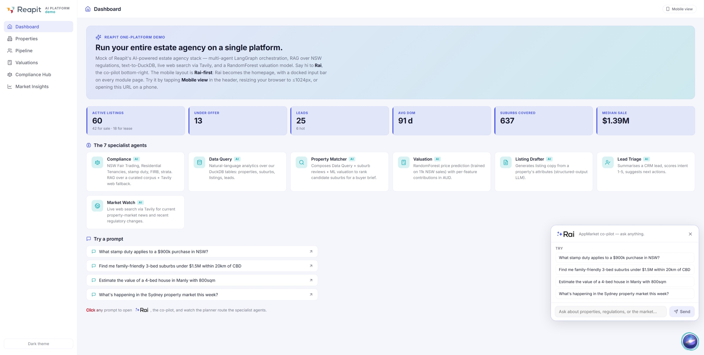
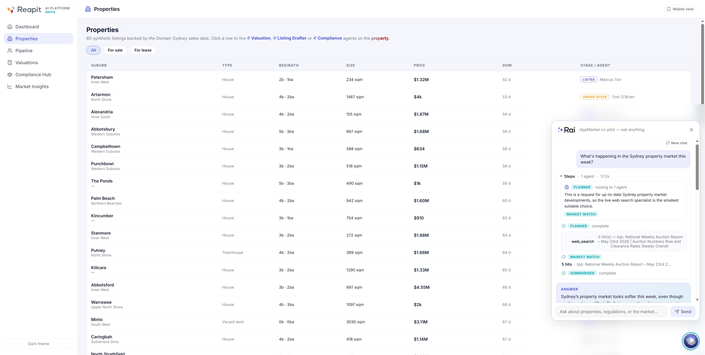
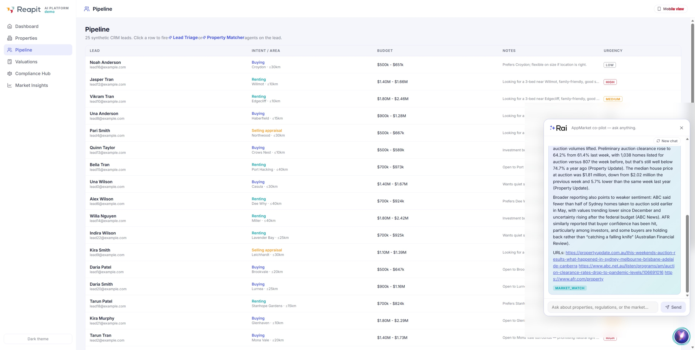
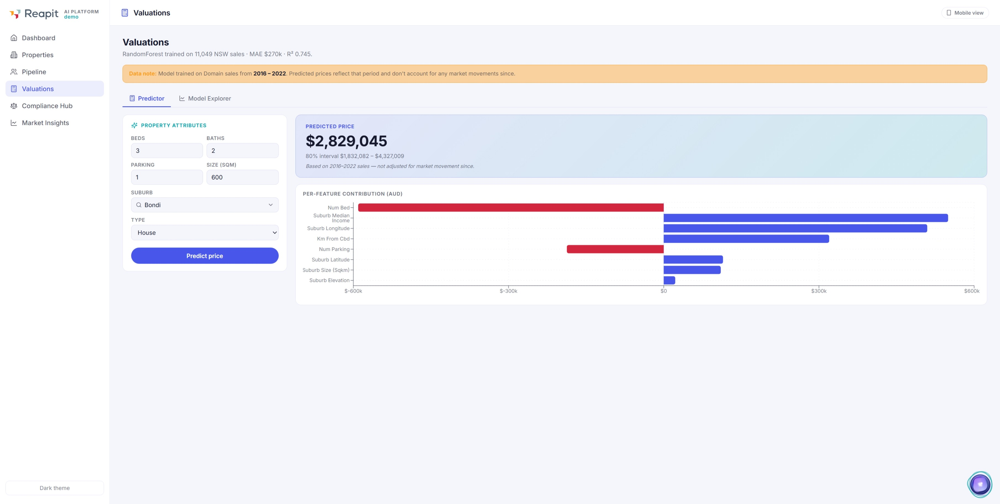
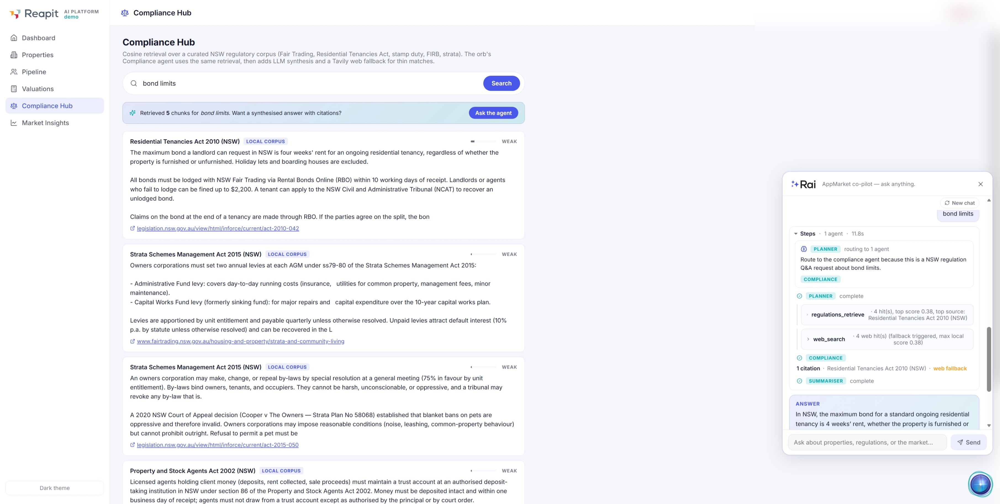
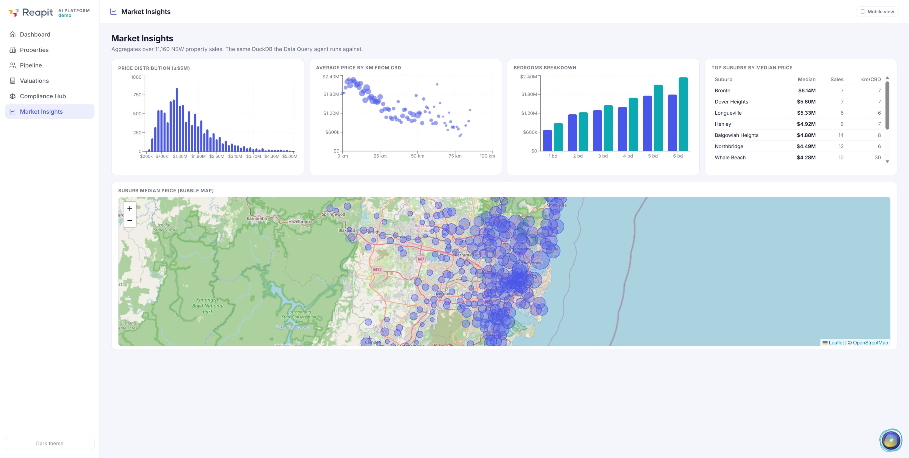
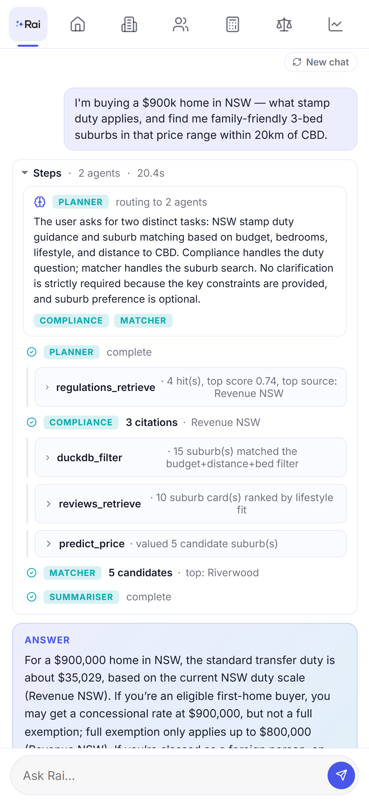
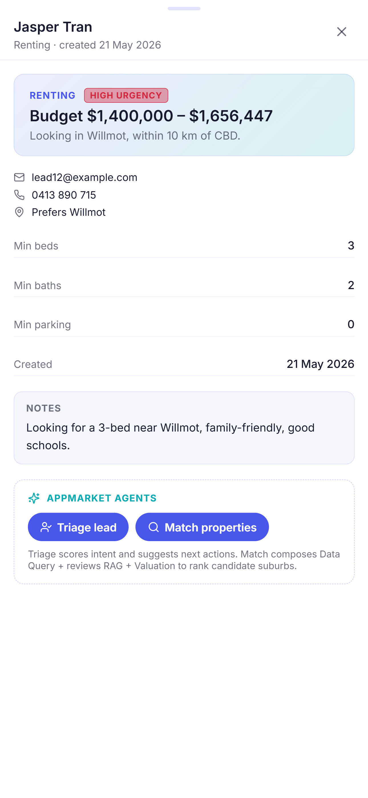

# ai-powered-app

A portfolio mock of Reapit's "One Platform" — sales, lettings, CRM, valuations,
compliance and analytics in one place, with **Rai**, a multi-agent AppMarket
co-pilot, woven through every page. Built around Sydney house-price Kaggle data
to showcase the AI-engineering stack a Reapit-grade engineer would actually
ship: LangGraph multi-agent orchestration, RAG, text-to-DuckDB, live web
search, a RandomForest valuation model, structured-output contracts, and a
three-tier eval suite with a CI gate.

> Status: **live on Azure.** Scale-to-zero Container Apps (nginx +
> FastAPI as sidecars in one app), Azure Database for MySQL Flexible +
> DuckDB, **Gemini for chat (gemini-3.5-flash-lite) and Azure OpenAI for
> embeddings (text-embedding-3-small)** on separate endpoints, both over
> the OpenAI-compatible surface, model +
> RAG parquets on public-read Blob, secrets in Key Vault via managed
> identity, deploys via GitHub Actions with workload identity federation
> (no static cloud keys in CI). Terraform in [`infra-azure/`](infra-azure/);
> the earlier AWS topology ([`infra/`](infra/)) is kept as reference.
> **51 Tier-1 tests green, 7/7 Tier-3 smoke evals passing against the
> live URL** (see [`evals/results/`](evals/results/)).
>
> **Live demo:** https://app.blackwave-53cf4f76.australiaeast.azurecontainerapps.io
> (HTTPS with managed TLS; scale-to-zero means the first request after
> idle takes ~30 s to wake the platform outside the weekday warm windows
> (10-11:30 am and 2-3 pm AEST) - a deliberate trade, and the platform
> holds the request rather than erroring).

---

## Headline capabilities

- **8 specialist agents** routed by an LLM planner with a heuristic fallback:
  Compliance (NSW regulations RAG + Tavily web fallback), Data Query
  (text-to-DuckDB), Property Matcher (composes 3 tools), Valuation (RandomForest),
  Listing Drafter, Lead Triage, Market Watch (live Tavily), and General
  (catch-all chat) — every agent emits a Pydantic-typed JSON object, enforced
  by a forced tool call whose parameter schema is the model's JSON schema.
- **6 module pages** mirroring Reapit's product surface: Dashboard, Properties,
  Pipeline (CRM), Valuations, Compliance Hub, Market Insights. Each module
  has a side drawer with **cross-module agent buttons** (Estimate value, Draft
  listing, Compliance check, Triage lead, Match properties).
- **The Orb** — a global "AppMarket co-pilot" that streams typed SSE events
  (`planner_decision`, `node_start`, `tool_call`, `tool_result`, `node_end`,
  `node_error`, `final_message`, `done`). Live agent trace renders as
  collapsible Steps cards so the user can watch the planner route + agents
  fan out in real time. Per-tab chat persists via `sessionStorage`.
- **Mobile-first responsive layout**. At ≤1024px the sidebar collapses to a
  top icon strip, Rai becomes the homepage, every module page gets a docked
  Rai input bar at the bottom that auto-hides on scroll-down and expands to a
  90dvh bottom sheet on tap. A "Mobile view" toggle on the desktop header lets
  reviewers preview the mobile shell without resizing the window.
- **Three-tier eval suite** with a GitHub Actions PR gate. See
  [`evals/README.md`](evals/README.md).
- **Reapit brand identity** — indigo `#4856EA` primary (sourced from the real
  Reapit AI logo SVG), teal AI accent, brand red sweeps and heartbeat pulses on
  call-to-action copy, real Reapit favicon + RAI logo.

## Screenshots

<table>
<tr>
<td width="50%"></td>
<td width="50%"></td>
</tr>
<tr>
<td><strong>Dashboard</strong> — hero, KPI strip, 7-agent capability grid, animated sample-prompts hint.</td>
<td><strong>Orb trace</strong> — multi-agent run mid-stream. Planner fans out to Compliance + Matcher; tool calls render as collapsible cards.</td>
</tr>
<tr>
<td></td>
<td></td>
</tr>
<tr>
<td><strong>Cited answer</strong> — $35,029 stamp duty with three Revenue NSW citations from the local corpus, no web fallback needed.</td>
<td><strong>Valuations Predictor</strong> — RandomForest price + 80% CI from tree spread + per-feature contributions in AUD (perturbation-based).</td>
</tr>
<tr>
<td></td>
<td></td>
</tr>
<tr>
<td><strong>Compliance Hub</strong> — direct RAG search with relevance meter strength bars (Strong / Match / Partial / Weak) and source-type chips.</td>
<td><strong>Market Insights</strong> — Recharts dashboards (price distribution, price vs km from CBD, beds breakdown, top suburbs) plus a Leaflet bubble map of suburb medians.</td>
</tr>
<tr>
<td></td>
<td></td>
</tr>
<tr>
<td><strong>Mobile home</strong> — Rai-as-homepage. The 6-icon top strip replaces the desktop sidebar; the pill input bar is the same UI as the docked bar on other pages.</td>
<td><strong>Mobile Pipeline</strong> — lead rows render as cards. The docked Rai bar pins to the bottom and auto-hides on scroll-down. Tap to expand into a 90dvh bottom sheet.</td>
</tr>
</table>

## Architecture

```
                       ┌──────────────────────┐
                       │  /orb/chat  SSE      │
                       └──────────┬───────────┘
                                  ▼
                       ┌──────────────────────┐
                       │   Planner (LLM)      │   structured-output decision
                       │ + heuristic fallback │   PlannerDecision(agents_to_call=...)
                       └──────────┬───────────┘
                                  │
       ┌──────────────────────────┼──────────────────────────┐
       ▼                          ▼                          ▼
 Compliance ─┐ ┌─ Data Query ─── Matcher ── Valuation ── Listing ── Lead Triage ── Market Watch ── General
       │     │ │    │              │            │           │            │              │
       │  ┌──┼─┘    │              ▼            ▼           ▼            ▼              ▼
       │  │  │      ▼          DuckDB +     model.pkl    LLM only   LLM only       Tavily search
   regulations.parquet      sql_validator   sklearn
   embeddings (cosine)      SELECT-only     RandomForest
       │     reviews.parquet ⤴
       │
       └─► Tavily fallback when local retrieval max score < 0.55
                                  │
                                  ▼
                       ┌──────────────────────┐
                       │  Summariser (LLM)    │   composes the user-facing reply
                       └──────────────────────┘
                                  │
                                  ▼
                            final_message
```

- **Backend**: FastAPI + LangGraph + Pydantic + DuckDB + MySQL (OLTP via
  SQLAlchemy + PyMySQL) + scikit-learn + Tavily. **Chat on Gemini,
  embeddings on Azure OpenAI** — `gemini-3.5-flash-lite` with forced
  tool use for structured outputs, `text-embedding-3-small` (1536-D),
  each on its own endpoint but both speaking the OpenAI protocol.
  The provider sits behind a one-file dispatcher
  (`services/llm.py` / `services/embed.py`); the original AWS Bedrock
  path is retained behind a settings flag as reference.
- **Frontend**: React 18 + Vite 5 + React Router 7 + Recharts + Leaflet +
  `react-ai-orb` (MIT package, re-skinned to the brand palette as
  `PlasmaOrb.jsx`) + lucide-react.
- **AI contracts**: every node emits a typed Pydantic model, and the graph
  state is itself a Pydantic model. Structured calls declare a single tool
  whose `parameters` schema is `response_model.model_json_schema()` and force
  it with `tool_choice`, then validate the arguments — the same shape on both
  providers. A JSON-mode retry covers a malformed tool call.
- **Harness**: 30s per-node `asyncio.wait_for`, 90s end-to-end, 1 retry on
  `pydantic.ValidationError`, typed `NodeError` captured into graph state on
  the second failure so the Summariser handles partial results gracefully.

## Live deployment topology (Azure)

```
                                 INTERNET
                                    │  HTTPS — ACA-managed TLS
                                    ▼
  ┌─ Azure · australiaeast · resource group rg-aipapp ───────────────────┐
  │                                                                      │
  │ Container Apps environment (cae-*)                                   │
  │  ┌─ container app "app"  ·  min 0 / max 1 replicas ───────────────┐  │
  │  │                                                                │  │
  │  │   frontend container            backend container              │  │
  │  │   nginx · SPA + proxy   ───►    FastAPI · uvicorn :8000        │  │
  │  │   0.25 vCPU / 0.5 GiB   127.0.0.1   0.5 vCPU / 1 GiB           │  │
  │  │   public ingress :80    (sidecar)   /api  /orb  /health        │  │
  │  └────────────────────────────────────────────────────────────────┘  │
  │                                    │  backend egress                 │
  │             ┌──────────────────────┼──────────────────────┐          │
  │   ┌─────────┬────────┐   ┌─────────┬────────┐   ┌─────────┬────────┐ │
  │   │ Gemini (chat)    │   │ MySQL Flexible   │   │ Blob storage     │ │
  │   │ flash-lite       │   │ B1ms             │   │ public-read      │ │
  │   │ + Azure OpenAI   │   │ [OLTP: source    │   │ model.pkl + RAG  │ │
  │   │ embeddings       │   │  of truth]       │   │ parquets         │ │
  │   └──────────────────┘   └──────────────────┘   └──────────────────┘ │
  │                                                                      │
  │  ┌────────────────────────────────────────────────────────────────┐  │
  │  │ Key Vault - tavily / llm / mysql secrets, read by the          │  │
  │  │ backend's user-assigned managed identity                       │  │
  │  └────────────────────────────────────────────────────────────────┘  │
  │                                                                      │
  │  (outbound also: tavily.com for Market Watch + Compliance)           │
  └──────────────────────────────────────────────────────────────────────┘
                                    ▲
                                    │  GitHub Actions OIDC → workload
                                    │  identity federation; GHCR images
                          ┌─────────┴────────┐
                          │ deploy-azure.yml │
                          └──────────────────┘
```

**Why one app with two containers.** nginx and FastAPI are sidecars in a
single Container App, so the SPA talks to the backend over `127.0.0.1`
— same origin, no CORS, and only one ingress to keep warm. Two apps
would have doubled the cold-start surface and needed internal ingress
between them for no benefit at this size.

**Deploy flow:** `git push main` → `.github/workflows/deploy-azure.yml`
builds both images and pushes to GHCR tagged `:<sha>` and `:latest` →
`azure/login` exchanges the Actions OIDC token against a user-assigned
managed identity (workload identity federation — no static cloud
credentials in GitHub) → two `az containerapp update --container-name`
calls roll the app's `backend` and `frontend` containers onto the new
images.

**Data flow on backend boot:** the app scales 0→1 → image pull from
GHCR → `scripts/download_artefacts.py` fetches `model.pkl` + the RAG
parquets over plain HTTPS from the public-read blob container (no SDK,
no credentials — the artefacts derive from public Kaggle data) →
`scripts/etl_mysql_to_duckdb.py` rebuilds the analytical DuckDB from
MySQL Flexible → execs uvicorn. First request after idle: ~30-60s.
MySQL is the source of truth for OLTP data; Blob is the source of truth
for the trained model + RAG corpora.

**Provider split:** chat and embeddings sit on separate endpoints, both
spoken over the OpenAI protocol — chat on Gemini
(`gemini-3.5-flash-lite`), embeddings on Azure OpenAI
(`text-embedding-3-small`, 1536-D). `LLM_BASE_URL` / `LLM_API_KEY` drive
chat; `EMBED_BASE_URL` / `EMBED_API_KEY` drive embeddings and fall back
to the `LLM_*` pair when unset, so a single-provider setup needs no extra
config. The split exists because the two have different constraints: the
graph is sequential and one Orb run is 5-9 LLM calls, so the chat model
is picked for per-minute request headroom, while swapping the embedding
model would mean rebuilding the RAG parquets to match vector widths.
Operational notes are in [`infra-azure/README.md`](infra-azure/README.md).

## Data architecture

The app runs on **two databases** with a real pipeline between them — the
"OLTP feeding OLAP" pattern that estate-agency platforms actually use in
production. Mirroring this here gives every interaction a credible
write-path and gives the analytics queries a denormalised table to scan.

```
   misc/*.csv                                       reads (transactional)
       │                                          ┌──────────────────────┐
       ▼                                          │ /api/properties      │
   build_mysql.py     ┌────────────────────┐      │ /api/pipeline        │
   (load + truncate)─►│   MySQL (OLTP)     │◄─────│ /orb/* (agent_runs)  │
                      │                    │      └──────────────────────┘
                      │ properties · leads │            writes
                      │ listings · agents  │      (lead status, agent_runs)
                      │ lead_events        │
                      │ agent_runs         │
                      └─────────┬──────────┘
                                │ extract → denormalise → load
                                ▼  (scripts/etl_mysql_to_duckdb.py)
                      ┌────────────────────┐
                      │  DuckDB (OLAP)     │      ┌──────────────────────┐
                      │                    │◄─────│ /api/insights        │
                      │ properties (flat)  │      │ /api/valuations      │
                      │ listings_enriched  │      │ Data Query agent     │
                      │ (view: 4-way JOIN) │      │ Matcher agent        │
                      └────────────────────┘      └──────────────────────┘
                              reads (analytics)
```

**OLTP — MySQL 8 / InnoDB**
- Source of truth. Normalised + indexed for point lookups. FK joins, audit
  logs, status state machines.
- Tables: `agents`, `properties`, `suburbs`, `leads`, `lead_events`
  (status-change audit log), `listings`, `agent_runs` (every orb
  invocation persists here — powers the **Recent agent activity** feed on
  the Dashboard).
- Schema is managed by numbered SQL files under `scripts/migrations/`
  and applied by `scripts/migrate_mysql.py` (tracks state in
  `schema_migrations` — idempotent).

**OLAP — DuckDB**
- Columnar, embedded, denormalised. Holds the 11k-row sales reference for
  the RandomForest + the `listings_enriched` view (properties + listings
  + suburbs + agents pre-joined) for sub-millisecond Insights queries.
- Rebuilt from MySQL by `scripts/etl_mysql_to_duckdb.py` — extract,
  rename `property_type → type`, recreate `listings_enriched`, recompute
  counts. Cheap enough to run on every backend boot, which is exactly
  what the deployed container does.

**Writes that close the loop**
- `POST /api/pipeline/leads/{id}/status` — transitions a lead in `leads` +
  appends a row to `lead_events` inside one transaction.
- `POST /orb/chat` — every run records to `agent_runs` after the SSE
  drain finishes, including duration, agents called, web-search usage,
  and (when invoked from a drawer) the related `lead_id` / `listing_id`.

**Local stack (docker-compose)** — `docker compose up -d mysql` brings up
MySQL on `:3306`; backend reads `MYSQL_HOST` / `MYSQL_PASSWORD` from
`.env`. **Cloud posture** — `infra-azure/` provisions MySQL Flexible
B1ms with the admin password held in Key Vault and read by the backend's
managed identity; the firewall stays shut, opened only for the one-off
`scripts/seed_all.py` run from a known IP and closed again by the next
`terraform apply`. See [infra-azure/README.md](infra-azure/README.md).
The AWS equivalent — `db.t4g.micro` RDS in private subnets, credentials
in Secrets Manager, seeding via a Fargate task inside the VPC with no
bastion — is documented in [infra/README.md](infra/README.md).

## Repo map

```
ai-powered-app/
├── README.md                         (you are here)
├── CLAUDE.md                         Root conventions (always loaded for Claude Code)
├── backend/
│   ├── CLAUDE.md                     Backend conventions
│   └── src/
│       ├── main.py                   FastAPI app, route registration
│       └── app/
│           ├── routers/              Thin handlers (/orb, /api/*)
│           └── services/
│               ├── agents/           LangGraph + 8 nodes + planner + summariser + schemas
│               ├── rag/              regulations + reviews cosine retrievers
│               ├── tools/web_search.py  Tavily wrapper
│               ├── model.py          predict_with_contributions()
│               └── sql_validator.py  DuckDB SELECT-only + allowlist
│   └── tests/                        Tier-1 pytest (51 cases)
├── frontend/
│   ├── CLAUDE.md                     Frontend conventions
│   └── src/
│       ├── pages/<Section>/<Page>.jsx  Auto-discovered by navigation.js
│       ├── components/common/
│       │   ├── UnifiedOrb.jsx        Desktop floating + mobile fullpage / docked / sheet
│       │   ├── PlasmaOrb.jsx         react-ai-orb shell, Reapit-tinted HSL
│       │   ├── SidebarNav.jsx        Desktop sidebar
│       │   ├── MobileNav.jsx         Top icon strip on mobile
│       │   ├── Drawer.jsx            Side drawer (desktop) / bottom sheet (mobile)
│       │   ├── SweepText.jsx         Red sweep + AgentActionHint chips
│       │   └── SearchableSelect.jsx  Used by Valuations suburb picker
│       ├── components/agents/        AgentTrace + ToolCallCard + AgentBadge
│       ├── context/                  Theme + Viewport (override) + Orb providers
│       └── lib/                      api.js, orbStream.js, useMediaQuery
├── evals/
│   ├── README.md                     Three-tier eval suite, how to add cases
│   ├── cases/*.yml                   14 golden cases covering all 8 agents
│   ├── run.py                        Tier 2 / Tier 3 runner
│   └── judge.py                      LLM-as-judge with structured-output rubric
├── scripts/                          Build pipeline (run once after clone)
│   ├── migrations/*.sql              MySQL schema migrations (numbered)
│   ├── migrate_mysql.py              Apply pending migrations
│   ├── build_mysql.py                CSVs → MySQL (OLTP source of truth)
│   ├── etl_mysql_to_duckdb.py        MySQL → DuckDB pipeline (analytics)
│   ├── seed_all.py                   One-shot: migrate + build + ETL
│   ├── build_db.py                   Legacy DuckDB-only build (CI fallback)
│   ├── train_model.py                RandomForest training
│   ├── stage_regulation_corpus.py    Writes 20 NSW regulation .md files
│   ├── build_regulation_corpus.py    Chunks + embeds (text-embedding-3-small)
│   ├── build_review_embeddings.py    Embeds 421 suburb cards (same model)
│   ├── download_artefacts.py         Backend boot — pull model + parquets from Blob/S3
│   └── upload_artefacts_to_s3.py     Legacy AWS — push rebuilt artefacts to S3
├── infra-azure/                      Terraform — LIVE: Container Apps + Azure OpenAI + MySQL Flexible + Blob + Key Vault + WIF
├── infra/                            Terraform — legacy AWS: VPC + RDS + ALB + ECS + ECR + S3 + Secrets + OIDC
├── backend/Dockerfile                Multi-stage uv build → slim runtime
├── frontend/Dockerfile               Vite build → nginx with SPA fallback + /api proxy
├── frontend/nginx.conf               Server-level root, SSE-friendly proxy_buffering off
├── docker-compose.yml                Full stack: MySQL + backend + frontend
├── misc/                             Kaggle CSVs + notebooks (read-only)
├── data/                             Built artefacts (gitignored except docs/)
└── .github/workflows/                evals-smoke.yml (Tier 3 PR gate)
                                      + deploy-azure.yml (live, push to main)
                                      + deploy.yml (legacy AWS, manual dispatch)
```

## Run locally

You need **one or two OpenAI-compatible endpoints** — anything speaking
the OpenAI protocol works — plus a Tavily key for Market Watch and the
Compliance web fallback. The live demo splits them: chat on Gemini,
embeddings on Azure OpenAI. Copy `.env.example` to `.env` and fill in:

```env
# Chat endpoint. Stay on a Lite model: gemini-3.5-flash is capped at 5
# requests/minute, and one Orb run is 5-9 sequential LLM calls.
LLM_BASE_URL=https://generativelanguage.googleapis.com/v1beta/openai/
LLM_API_KEY=<Google AI Studio key>
LLM_CHAT_MODEL=gemini-3.5-flash-lite

# Embedding endpoint. Leave EMBED_* blank to reuse the chat endpoint.
# On Azure OpenAI, LLM_EMBED_MODEL is a *deployment* name, not a model id.
EMBED_BASE_URL=https://<your-account>.openai.azure.com/openai/v1/
EMBED_API_KEY=<key>
LLM_EMBED_MODEL=text-embedding-3-small

TAVILY_API_KEY=<get a free one at tavily.com>
```

`infra-azure/` provisions the Azure OpenAI account used for embeddings and
prints its values (`terraform output -raw llm_base_url` / `llm_api_key`)
— see [infra-azure/README.md](infra-azure/README.md).

The original AWS Bedrock path is still in the tree behind
`LLM_PROVIDER=bedrock` / `EMBED_PROVIDER=bedrock` (Claude Sonnet 4.6 +
Titan Embed v2; needs AWS credentials and Bedrock model access). Install its client with `uv sync --extra bedrock` - boto3 is not part of the runtime image. The
embedding dimensions differ — 1536-D for text-embedding-3-small against
1024-D for Titan v2 — so switching providers means rebuilding the RAG
parquets with `build_regulation_corpus.py` + `build_review_embeddings.py`.

Then:

```powershell
# 0) MySQL (OLTP). Boots in ~5s; defaults in docker-compose match .env.example.
docker compose up -d mysql

# 1) One-time: seed MySQL, then ETL into DuckDB, train model + embeddings.
cd backend
uv sync
uv run python ../scripts/seed_all.py            # migrate + build_mysql + ETL → DuckDB
uv run python ../scripts/train_model.py
uv run python ../scripts/stage_regulation_corpus.py
uv run python ../scripts/build_regulation_corpus.py
uv run python ../scripts/build_review_embeddings.py

# Backend (terminal 1)
uv run uvicorn src.main:app --reload --port 8000

# Frontend (terminal 2)
cd frontend
npm install
npm run dev   # http://localhost:5173

# Tier-1 pytest
cd backend
uv run pytest                         # 51 tests, ~10s

# Tier-3 eval smoke (against the running backend)
uv run python ../evals/run.py --tier smoke

# Tier-2 LLM-judge full run (~3 min)
uv run python ../evals/run.py --tier full
```

### Or: full stack via docker compose

```powershell
# After the one-time uv-run data build above (model.pkl + parquet + DuckDB):
docker compose up -d --build
# -> MySQL on :3306, FastAPI on :8000, nginx-served SPA on :8080

# All three containers wait on healthchecks before the next starts; first
# build takes ~2 min. data/ mounts as a bind volume so re-running the
# scripts on the host updates what the container reads. Stop the stack:
docker compose down              # keeps the MySQL volume
docker compose down --volumes    # nukes the seed data too
```

The nginx container proxies `/api/*`, `/orb/*`, and `/health` to the
backend service over the compose network, so the SPA is single-origin
(no CORS round-trip) and SSE streams unbuffered (no `nginx` cache, no
`X-Accel-Buffering`).

## Deploy it yourself

### Azure (the live path)

Full runbook — prerequisites, ordering, the seed step, and the day-30
pay-as-you-go reminder — lives in
[`infra-azure/README.md`](infra-azure/README.md). The short version:

```powershell
# One-time. Needs az login + Terraform >= 1.7 + a Tavily key in
# infra-azure/terraform.tfvars (gitignored).
cd infra-azure
terraform init
terraform apply          # ~15 min; MySQL Flexible is the slow part
```

Terraform creates the resource group, Container Apps environment + the
single `app`, the Azure OpenAI account and its two deployments, MySQL
Flexible, the blob container, Key Vault + the backend's managed
identity, and the GitHub OIDC federated credential. Afterwards: point
`.env`'s `EMBED_*` at the new Azure OpenAI, rebuild the RAG parquets (the embedding
model determines the vector width), upload artefacts to blob, seed
MySQL once through a temporary firewall rule, then set the three repo
secrets (`AZURE_CLIENT_ID`, `AZURE_TENANT_ID`, `AZURE_SUBSCRIPTION_ID`)
so `deploy-azure.yml` can log in without stored credentials.

```powershell
# Get the URL and smoke it end-to-end
$url = terraform -chdir=infra-azure output -raw frontend_url
curl "$url/health"                                   # cold start on first hit
cd backend
uv run python ..\evals\run.py --tier smoke --backend $url
```

Teardown: `terraform -chdir=infra-azure destroy`.

### Legacy: the AWS topology

The first deployment ran on ECS Fargate behind an ALB with Bedrock for
inference. It is offline (credits exhausted) but kept intact as
reference — Terraform in [`infra/`](infra/), and `deploy.yml` still
exists as a manual-dispatch workflow. Runbook in
[infra/README.md](infra/README.md).

<details>
<summary>AWS topology diagram, deploy flow, and Phase 2 status</summary>

```
                              INTERNET
                                 │
                                 ▼
   ┌────────────────────────────────────────────────────────────────┐
   │  AWS account <redacted> / region ap-southeast-2 (Sydney)       │
   │                                                                 │
   │  ┌─────────────────────────────────────────────────────────┐   │
   │  │           VPC  10.40.0.0/16  (2 AZs)                    │   │
   │  │                                                          │   │
   │  │  ┌─ PUBLIC SUBNETS (a / b) ────────────────────────┐    │   │
   │  │  │    Internet Gateway                              │    │   │
   │  │  │    │                                             │    │   │
   │  │  │    ▼                                             │    │   │
   │  │  │  ┌──────────────────┐   ┌──────────────┐         │    │   │
   │  │  │  │ Application Load │   │ NAT Gateway  │         │    │   │
   │  │  │  │ Balancer (HTTP)  │   │ + EIP        │         │    │   │
   │  │  │  └────────┬─────────┘   └──────┬───────┘         │    │   │
   │  │  └───────────┼────────────────────┼─────────────────┘    │   │
   │  │              │ path /api,/orb,/health      │              │   │
   │  │              │ -> backend                  │              │   │
   │  │              │ else -> frontend            │              │   │
   │  │              ▼                              ▼              │   │
   │  │  ┌─ PRIVATE SUBNETS (a / b) ──────────────────────────┐  │   │
   │  │  │                                                     │  │   │
   │  │  │  ┌──────────────┐   ┌──────────────┐   ┌───────┐   │  │   │
   │  │  │  │  Fargate     │   │  Fargate     │   │  RDS  │   │  │   │
   │  │  │  │  backend:1   │◄──┤  frontend:1  │   │ MySQL │   │  │   │
   │  │  │  │  (FastAPI)   │   │  (nginx SPA) │   │  8.0  │   │  │   │
   │  │  │  │  512 cpu     │   │  256 cpu     │   │ t4g.μ │   │  │   │
   │  │  │  │  1 GiB       │   │  512 MiB     │   │       │   │  │   │
   │  │  │  └──────┬───────┘   └──────────────┘   └───▲───┘   │  │   │
   │  │  │         │                                  │       │  │   │
   │  │  │         └───────  reads/writes ────────────┘       │  │   │
   │  │  └──────────────────────────┬──────────────────────────┘  │   │
   │  └─────────────────────────────┼──────────────────────────────┘  │
   │                                │ outbound only (via NAT)         │
   │                                ▼                                  │
   │      ┌──────────────────┐  ┌──────────────────┐                  │
   │      │   AWS Bedrock    │  │ Secrets Manager  │                  │
   │      │ Claude Sonnet 4.6│  │ (db creds,       │                  │
   │      │ + Titan Embed v2 │  │  tavily-api-key) │                  │
   │      │ (au. profiles)   │  └──────────────────┘                  │
   │      └──────────────────┘                                        │
   │                                                                   │
   │      ┌──────────────────┐  ┌──────────────────┐                  │
   │      │   S3 artefacts   │  │  CloudWatch Logs │                  │
   │      │  model.pkl +     │  │  (30d retention) │                  │
   │      │  RAG parquets    │  └──────────────────┘                  │
   │      │  (versioned)     │                                         │
   │      └──────────────────┘  ┌──────────────────┐                  │
   │                            │  ECR (2 repos)   │                  │
   │                            │  + scan on push  │                  │
   │                            └──────────────────┘                  │
   │                                                                   │
   │     (Outbound also: Tavily.com for Market Watch)                 │
   └──────────────────────────────────────────────────────────────────┘
                                 ▲
                                 │
                                 │  GitHub Actions OIDC
                                 │  (no static keys)
                                 │  on push to main:
                                 │   1. build + push ECR
                                 │   2. register new task def revision
                                 │   3. update ECS service, wait for stable
                                 │
                       ┌─────────┴─────────┐
                       │  GitHub Actions   │
                       │  deploy.yml       │
                       └───────────────────┘
```

**Deploy flow:** `git push main` → GHA assumes `gha-deploy` IAM role via OIDC
→ builds backend + frontend images → pushes to ECR with `:<sha>` + `:latest`
tags → registers a new task definition revision (patches just the image URI)
→ `aws ecs update-service` with `wait-for-service-stability`. Round-trip ~5
minutes. Terraform manages the durable infra (VPC, RDS, IAM, ECS service
shape); the GHA workflow only ever changes the image inside the task def.

**Data flow on backend boot:** Container starts →
`scripts/download_artefacts.py` pulls `model.pkl` + RAG parquets from
S3 (~3s) → `scripts/etl_mysql_to_duckdb.py` rebuilds the analytical
DuckDB from RDS (~3s) → execs uvicorn. Cold start: ~6-8s before
`/health` returns 200. Each Fargate replica maintains its own DuckDB +
its own local copy of the model files; MySQL is the single source of
truth for OLTP data (properties, leads, agent_runs, lead_events); S3
is the single source of truth for the trained model + RAG corpora.

**Phase 2 (AWS) shipped in six steps:**

| Step | What | Status |
|---|---|---|
| 0 | MySQL OLTP layer + ETL pipeline + RDS Terraform | ✓ shipped |
| 1 | Bedrock provider toggle + prompt caching | ✓ shipped |
| 2 | Backend + frontend Dockerfiles + docker-compose | ✓ shipped |
| 3 | Compute Terraform (ECR + ALB + ECS services + OIDC) | ✓ shipped |
| 4 | GitHub Actions deploy workflow | ✓ shipped |
| 5 | Data artefacts + runtime secrets baked in | ✓ shipped |
| 6 | S3 artefact bucket + Bedrock Titan embeddings (no external AI dependency) | ✓ shipped |

**Provision + deploy (as it was):** `terraform apply -var "github_repository=<owner>/<repo>"`
in `infra/` (~10 min, ~$77/mo while running), copy nine Terraform
outputs into the repo's Actions **Variables**, seed RDS with
`aws ecs run-task` against the seed task family, then
`echo "http://$(terraform output -raw alb_dns_name)"`.
`terraform destroy` takes it back to zero cost.

</details>

## 5-minute demo script

Open the [live demo](https://app.blackwave-53cf4f76.australiaeast.azurecontainerapps.io)
— give the first request ~30-60s to wake the platform — or `localhost:5173`
if you are running it yourself. Click **Mobile view** in the header to preview
the mobile shell. Click each prompt in turn; every wow moment is one click away
from the Dashboard.

| # | Action | What to watch for |
|---|---|---|
| 1 | Click the **first sample prompt** on Dashboard: *"What stamp duty applies to a $900k purchase in NSW?"* | Orb opens, **Planner** routes to **Compliance**, RAG retrieves 3-4 cited NSW chunks, summariser composes the **$35,029** answer with citations. |
| 2 | Click the **Property Matcher** agent card on Dashboard | Orb fires *"Find me family-friendly 3-bed suburbs under $1.5M within 20km of CBD"*. Trace fans out: **Data Query** → reviews RAG → **Valuation** per candidate. Final answer lists 5 ranked suburbs with predicted prices. |
| 3 | Sidebar → **Properties** → click any row → drawer opens → click **Draft listing** | Orb fires *Listing Drafter* with the property's attributes. Markdown headline + body + key features render in the answer card. |
| 4 | Sidebar → **Pipeline** → click a lead → drawer → **Match properties** | Triggers `/orb/run-agent` (skips planner) → **Matcher** runs the buyer brief from the lead's `min_bed` / `budget_max` / `preferred_suburb`. Cross-module flow demonstrated. |
| 5 | Sidebar → **Valuations** → fill form (any suburb from the searchable dropdown) → **Predict price** | Direct REST call to `/api/valuations/predict`. Predicted price card + **80% confidence interval** (computed from the spread of individual tree predictions) + a horizontal bar chart of **per-feature contributions in AUD** (perturbation-based). |
| 6 | Sidebar → **Market Insights** | Recharts: price distribution histogram, price-vs-distance scatter, beds breakdown, top-suburbs table, plus a Leaflet bubble map coloured by suburb median. |
| 7 *(optional)* | Orb → ask *"What's happening in the Sydney property market this week?"* | **Market Watch** routes to Tavily, returns 5 hits with URLs, LLM synthesises a cited 3-4 sentence answer with live numbers from the news. |

## Engineering proof points

The pieces that show this is more than a happy-path demo:

- **Structured outputs everywhere** — `services/agents/schemas.py` is the
  single source of truth for graph state + every node's return shape. Each
  structured call ships the Pydantic model's JSON schema as a single tool's
  `parameters` and pins `tool_choice` to it, so the arguments come back
  shaped — the model enforces the schema, not a parser — with a JSON-mode
  retry if a tool call ever comes back malformed.
- **Conditional web fallback in Compliance** — when local cosine max score
  drops below 0.55, the node calls Tavily scoped to NSW gov domains and
  merges the hits with a `source_type: "web"` discriminator so the UI can
  badge them. Sophisticated retrieval pattern, not a fixed cascade.
- **SQL validator** with allowlist + LIMIT injection + CTE-aware
  `WITH ... AS (...)` name extraction. Catches injection in `tests/agents/
  test_sql_validator.py`.
- **Three-tier evals**:
  - Tier 1 — `pytest backend/tests/` (72 cases, ~5s, gated by
    `.github/workflows/tests.yml` on every PR and push to main; hermetic,
    so it needs no API keys).
  - Tier 2 — `evals/run.py --tier full` (14 golden cases + LLM-judge rubric).
  - Tier 3 — `.github/workflows/evals-smoke.yml` PR gate (7 cases, string
    assertions, no LLM judge).
- **Mobile shell** — `useMediaQuery` ≤1024px + a viewport-override context so
  reviewers can preview from desktop. Real responsive work, not "we put
  `@media` queries in." See `lib/useMediaQuery.js`,
  `context/ViewportContext.jsx`, `components/common/MobileNav.jsx`,
  `UnifiedOrb.jsx` modes branch.
- **Per-tab chat persistence** in the orb via `sessionStorage` with stale
  `running: true` flags sanitised on hydration.
- **Reapit-graded brand fidelity** — palette extracted directly from the
  Reapit AI SVG (`#4856EA` indigo, `#0BAAB2` teal, `#D1263D` red, `#FD9E1D`
  orange). Real Reapit favicon + RAI logo. Mobile View toggle pill has the
  same red sweep + heartbeat as the dashboard hint.
- **Provider-swappable LLM layer** — every agent calls
  `chat_structured(...)` / `chat_text(...)` from `services/llm.py`;
  embeddings go through `services/embed.py`. Both are one-file
  dispatchers keyed on `LLM_PROVIDER` / `EMBED_PROVIDER`, and both
  provider modules expose the identical shape. The live path runs chat
  and embeddings on *different* providers — Gemini and Azure OpenAI —
  through the same two helpers; the AWS Bedrock path
  (`converse` with forced tool-use, plus a `cachePoint` after the system
  blocks so the 50-150 line agent prompts get cached at 5-min TTL) is
  retained behind the flag and still unit-tested. Re-pointing the whole
  app at a different inference provider was a two-module change — which
  is the entire argument for the dispatcher.
- **Real cloud deploy, twice, with infra-as-code both times.** The live
  topology is Terraform under `infra-azure/` — Container Apps environment,
  the sidecar app, Azure OpenAI + its deployments, MySQL Flexible, blob
  artefacts, Key Vault read through a user-assigned managed identity, and
  the GitHub federated credential. CI logs in with an OIDC token exchanged
  for that identity, so no cloud credential is ever stored in GitHub. The
  earlier AWS build (~600 lines under `infra/`: VPC across 2 AZs, RDS in
  private subnets, ALB, ECR, ECS Fargate, Secrets Manager, OIDC trust) is
  kept as reference. Migrating between two clouds without changing an
  agent is the part worth reading.
- **Zero standing credentials.** Runtime secrets live in Key Vault and
  reach the container as secret references resolved by managed identity;
  CI authenticates by workload identity federation. The app scales to
  zero between visits, and the cold-start honesty note in the header is a
  deliberate trade, not an oversight.
- **OLTP + OLAP split with a real pipeline**. Properties + leads + listings
  + agent_runs + lead_events live in RDS MySQL (transactional, normalised,
  audit log on lead status transitions, every Rai prompt persisted).
  Analytical queries hit a local DuckDB rebuilt from MySQL on every backend
  boot via `scripts/etl_mysql_to_duckdb.py`. The Dashboard "Recent agent
  activity" feed is the visible loop — fire a Rai prompt, watch the row
  land in the feed within seconds.

## Plan of record

The whole build is anchored to a Plan-mode plan, refined live with the user
across multiple iterations:

```
~/.claude/plans/under-misc-folder-each-quiet-starfish.md
```

Read that for the design rationale, the agent inputs/outputs spec, and the
verification checklist.

## What's still deferred

Phase 2 (AWS) shipped all six steps, and the Azure migration is live.
These are honest follow-ups, not blockers:

- **Custom domain**. HTTPS is already there — Container Apps issues and
  renews a managed certificate for the `*.azurecontainerapps.io`
  hostname. A vanity domain needs a CNAME + a managed-certificate
  binding; ~30 min once a domain is parked.
- **Warm windows** - shipped. `.github/workflows/warm.yml` pings the app
  every 20 minutes during 10:00-11:30 and 14:00-15:00 AEST on weekdays,
  so viewers in those windows skip the cold start; `workflow_dispatch`
  warms it on demand before a screen-share. Outside the windows it
  scales to zero as before.
- **Observability upgrade**. LangSmith or OpenTelemetry tracing so every
  node + tool call + retry shows up in a real dashboard (structured
  stdout through Container Apps log analytics works today).
- **Eval trend page** inside the app — reads `evals/results/*.json` and
  trends pass-rate-per-day with sparklines.
- **Drag-to-close** on the mobile bottom sheet (UX polish).
- **Private networking, multi-replica, WAF** — overkill for a portfolio
  demo, deliberately omitted. Trade-offs and limits are written down
  in [`infra-azure/README.md`](infra-azure/README.md) (and, for the AWS
  build, [`infra/README.md`](infra/README.md)).

## Credits

- Sydney house-price data: [`alexlau203/sydney-house-prices`](https://www.kaggle.com/datasets/alexlau203/sydney-house-prices) on Kaggle.
- Sydney suburb reviews: [`karltse/sydney-suburbs-reviews`](https://www.kaggle.com/datasets/karltse/sydney-suburbs-reviews) on Kaggle.
- Orb visual: [`react-ai-orb`](https://www.npmjs.com/package/react-ai-orb) (MIT), re-skinned to the Reapit palette in `PlasmaOrb.jsx`.
- Reapit branding: [reapit.com.au](https://www.reapit.com.au/) and [rai.reapit.com](https://rai.reapit.com/). This is an unaffiliated portfolio mock, not a Reapit product.
- Built with Claude Code.
